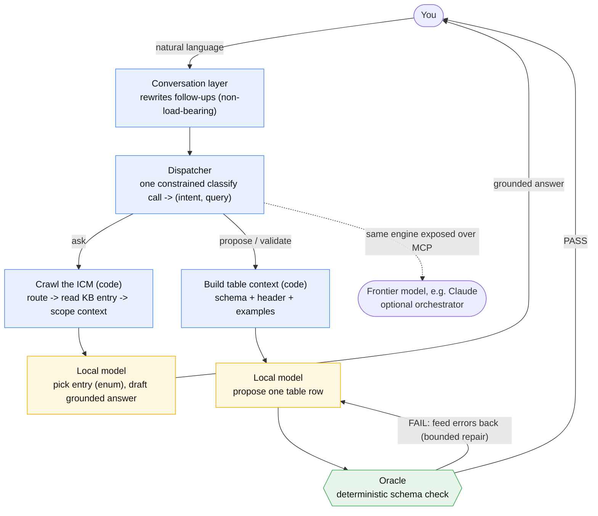

# A local-model host for Interpretable Context Methodology (ICM)

`icm` runs **ICM** instances on a small, local language model, adding a deterministic *oracle* that
checks the model's output. You point the host at a folder (an "instance") - a knowledge base, table
schemas, scripts, and workflows - and it gives you a chat console, a small editor GUI, and an
[MCP](https://modelcontextprotocol.io) server over that instance.

It is Windows-native and dependency-light: it builds with the C# compiler that ships in the box with
the .NET Framework (no SDK, no NuGet, no MSBuild) and talks to a local [Ollama](https://ollama.com)
over plain HTTP.

## What is ICM?

**Interpretable Context Methodology (ICM)** is a methodology by Jake Van Clief and David McDermott
(University of Edinburgh / Eduba; MIT-licensed;
[paper](https://arxiv.org/abs/2603.16021),
[repo](https://github.com/RinDig/Interpretable-Context-Methodology-ICM)) that replaces
framework-level multi-agent orchestration with **filesystem structure**: folders are stages, plain
markdown files carry the prompts and context for a single orchestrating agent, and local scripts do
the mechanical work that needs no AI. Every stage's output is a plain file a human can read and edit
before the next stage runs, so the whole workflow stays inspectable and editable with a text editor.
The folder structure does what a framework would otherwise do in code: sequencing, context scoping,
and state.

This project applies those ideas to a **local** model and adds one piece the original does not need:
a deterministic **oracle**. A small local model is an unreliable decider, so here it never decides -
it *proposes*, and a deterministic check *accepts or rejects* each proposal.

## The idea: propose, then verify

A small local model is unreliable when you ask it to *decide* things or to drive an open-ended
tool-calling loop. It is reliable when each call is narrow and its output is checked. So this host
splits every task into three roles with one trust line:

| Role | Trusted to | Not trusted to |
| --- | --- | --- |
| **Model** (the proposer) | pick from an enum, draft text, write one table row | be right on its own; choose what runs next |
| **Code** (the glue) | read files, run tools, sequence steps | (it has no judgment to misuse) |
| **Oracle** (the decider) | accept or reject a proposal, deterministically | have opinions |

The oracle here is a **schema-driven validator for tab-separated tables**: it checks column count
(the classic "a tab got added or dropped" corruption), types, numeric ranges, and enum membership.
Because the verdict is deterministic, a wrong proposal is *caught*, not trusted - and the model can
be sent the exact errors and asked to try again, within a bound.

Two guardrails keep this honest:

- **The console is a dispatcher, not a chat.** Each turn is one constrained classify call
  (`{intent, query}`); then code runs the chosen capability. The model never improvises a tool loop.
- **Tools are declared; the model only fills arguments.** A tool's command is authored in the
  instance, never invented by the model. *Which* tool runs is decided by an authored workflow or by a
  capable orchestrator (e.g. Claude over MCP) - never by an open local-model loop.

## Local-model adaptation: how this differs from ICM

ICM as published assumes a *capable* orchestrating agent (the paper's examples use Claude) that
**roams the folder structure itself** - it reads the routing files, decides which entries and which
stage to load, produces each stage's output, and a human reviews the plain-file result. A small
**local** model simply *can't do that*: behind a generate API it has no file access and no tool use
at all - it only turns a prompt into text. (And even within a single call, it can't reliably be
trusted to decide what runs next or to format itself.) So this host keeps ICM's "structure is the
architecture" idea but moves the orchestration **out of the model and into deterministic code**, and
adds a machine check the frontier setup did not need.

| Concern | ICM (frontier agent) | This host (local model) |
| --- | --- | --- |
| Navigating the folders | the agent reads them and picks what to load | code crawls: a constrained **enum pick** chooses the entry, then code reads and **injects** the scoped context |
| Sequencing | the agent decides what runs next across numbered stages | a deterministic **dispatcher** (one constrained classify) and authored **flows** sequence the work |
| Checking output | a human reviews each stage's file | a deterministic **oracle** gates table output, with bounded repair (the human still edits) |
| Model output shape | trusted to format itself | **grammar/enum-constrained**, so only a valid shape can be emitted |
| Tools | the agent calls local scripts / MCP as it sees fit | tools are **declared**; the model only fills arguments; *which* tool runs is a flow's or a frontier orchestrator's call |
| Orchestrator seat | the capable agent, always | you direct it from the chat by default; the **same instance is exposed over MCP**, so a frontier model (or any other MCP client) can take the seat when you want |

The key move is the **injection**. Rather than letting the model wander the filesystem (safe for a
frontier model, not for a local one), the host does the layered context loading itself and injects
the precisely-scoped context into each constrained call. The model never crawls; code crawls *for*
it and hands it one narrow, checkable decision at a time. The same machinery is what the built-in MCP
server exposes - one engine, two callers: the local dispatcher, or a frontier model over MCP.



The blue nodes are deterministic code (the orchestrator), the amber nodes are the only points the
local model is called (each a single constrained proposal), and the green node is the oracle that
decides. Code does the crawling and the sequencing; the model only ever proposes.

## What you get

Two Windows executables built from one shared codebase:

- **`icm.exe`** - a console CLI: open / chat / mcp / flow / validate / gen / selftest.
- **`icm-gui.exe`** - a small "VSCode-lite" GUI: a workspace file tree (add / rename / delete / edit,
  confined to the opened folder), a text editor with a line-number gutter and find/replace, and a
  chat panel that drives the same engine as the console.

Prebuilt binaries are included in this folder, so you can run it without building anything.

## Quick start

**Prerequisites:** Windows 10/11 (the .NET Framework 4.x it needs is already installed).
[Ollama](https://ollama.com) running locally is required for the model-backed features (`chat`,
`ask`, `propose`, `gen`); `validate`, `selftest`, and script tools need no model. By default the host
talks to `http://localhost:11434` and uses `qwen3-coder:latest` (generation) and `nomic-embed-text`;
change these per instance in `icm.config.json`, or override the URL with the `OLLAMA_URL` env var.

From this folder:

```
.\icm.cmd selftest                           # verify the deterministic core (no model needed)
.\icm.cmd open example-icm                    # load + summarize the bundled example instance
.\icm.cmd validate example-icm tasks          # run the oracle on a table -> PASS
.\icm.cmd validate example-icm tasks_broken   # -> FAIL, prints the 4 planted faults (exit code 2)
.\icm-gui.cmd example-icm                      # open the GUI on the example instance
.\icm.cmd chat example-icm                     # operator console (needs Ollama)
```

> **Why `.cmd` and not `.exe`?** Run the `.cmd` launchers, not the bare `.exe` files. On Windows 11
> with Smart App Control on, an unsigned downloaded `.exe` is blocked from running directly; the
> launchers load the program in-memory inside the already-trusted PowerShell, which Smart App Control
> allows. See [Running under Smart App Control](#running-under-smart-app-control). Tip: add this
> folder to your `PATH` and you can run `icm ...` / `icm-gui .` from anywhere.

## The GUI

```
.\icm-gui.cmd                  # opens empty; use File > Open Folder
.\icm-gui.cmd example-icm      # open straight into an instance
```

Open any folder as a workspace; the tree, editor, and file operations are confined to that root. When
the folder is an instance (it has an `icm.config.json`), the chat panel activates and the dispatcher's
step trace streams into the log.

### Keyboard shortcuts

| Key | Action | Key | Action |
| --- | --- | --- | --- |
| Ctrl+O | Open folder | Ctrl+G | Go to line |
| Ctrl+P | Quick Open (fuzzy file find) | Alt+Z | Toggle word wrap |
| Ctrl+N | New file | Ctrl++ / Ctrl+- / Ctrl+0 | Editor zoom in / out / reset |
| Ctrl+S | Save | F5 | Refresh tree |
| Ctrl+W | Close file | F8 | Validate current file (oracle on the editor buffer) |
| Ctrl+F / Ctrl+H | Find / Replace | Ctrl+Shift+E / Ctrl+L | Focus tree / chat |
| Ctrl+Z / Ctrl+Y | Undo / redo (editor) | Esc | Close Find / Quick Open |

File tree: `Del` delete, `F2` rename, `Enter` open. Chat input: `Enter` or `Ctrl+Enter` sends,
`Shift+Enter` inserts a newline.

## How the chat works

The chat looks like a conversation but is a constrained router underneath. Each turn:

1. **Conversation layer** (optional) - rewrites a follow-up like "now do the same for the other
   table" into a standalone request. Non-load-bearing: a bad rewrite only costs a wrong intent.
2. **Dispatcher** - one constrained call classifies the line into an intent and extracts the query.
3. **Capability** - code runs the chosen capability deterministically:
   - `ask` - answer a question, grounded in one knowledge-base entry.
   - `validate` - run the oracle on a named table.
   - `propose` - the proposer/oracle loop: the model proposes a new table row, the oracle validates
     it, and on failure the exact errors are fed back for a bounded repair. On success the GUI offers
     to insert the validated row into the table file (you review and save). If it can't converge, it
     reports the oracle's verdict instead of writing a bad row.
   - `make` - freeform generation that is not a table row.

### Model seats, and yes - it still generates plain text

A turn uses up to two model "seats", set per instance in `icm.config.json`:

- the **dispatch** seat - a small model that makes the one constrained classify/route call;
- the **generate** seat - the model that actually writes text: the grounded `ask` answer, the
  freeform `make` output, and the proposed table row.

They can be the same model (the example uses one for both) or two different models - a tiny model for
dispatch and a larger one for generation, for instance.

And yes, the local model still does ordinary generative text. `make` in the chat (and `icm gen` on
the CLI) call the **generate** seat directly with **no oracle and no schema constraint** - you get
plain model output. The oracle and the grammar constraints apply only to the structured capabilities
(`propose` / `validate`); they never sit between you and free-form generation. The dispatch seat only
ever does the routing - it is the generate seat that produces the prose.

## Commands

```
icm open  <dir>                 load + summarize an instance
icm chat  <dir>                 operator console (dispatcher; needs Ollama)
icm mcp   <dir>                 serve the instance over MCP (stdio)
icm flow  <dir> <name> [in...]  run an authored workflow (flows/<name>.json)
icm validate <dir> <table>      run the oracle on schemas/<table>.json + samples/<table>.txt
icm gen   <dir> <prompt...>     one raw generate call (smoke-test the model)
icm selftest                    check the deterministic core (oracle/json/tsv/paths; no model)
```

`OLLAMA_URL` overrides the instance's configured `ollama_url`.

## Configuration

Configuration is **per-instance**: each instance folder has its own `icm.config.json`. There is no
global host config - point the host at a different folder and it uses that folder's settings. The
settings that matter most:

**Which model(s) to use.** The host uses named model "seats":

```json
"models": {
  "generate": "qwen3-coder:latest",
  "dispatch": "qwen3-coder:latest",
  "embed":    "nomic-embed-text"
}
```

- `generate` - writes the actual text (grounded answers, freeform `make`, proposed rows).
- `dispatch` - the small classify/route call; omit it to reuse the `generate` model.
- `embed` - optional, reserved for embedding-based routing.

Use any models you have pulled in Ollama (`ollama pull <name>`, list with `ollama list`). The flat
fields `model` / `embed_model` are also accepted as a fallback.

**The Ollama connection.** Defaults to `http://localhost:11434`. Set it per instance:

```json
"ollama_url": "http://localhost:11434"
```

or override it for a single run with the `OLLAMA_URL` environment variable (the env var wins over the
file). Point this at a different port or a remote Ollama as needed.

**Other settings.** `name` and `domain` (shown by `icm open` and woven into prompts) and `tools` (the
capabilities the instance exposes - see [Tools](#tools)).

After editing, run `icm open <dir>` to see the resolved model seats and Ollama URL it will use.

## Build your own instance (the contract)

An instance is just a folder. Copy `example-icm/` and edit the pieces you need - the host runs
whatever it finds, and every piece is optional.

```
my-icm/
  icm.config.json     name, domain, model seats, and the tools this instance exposes
  manifest.json       the routing index: {id, title, path, summary} per knowledge-base entry
  SYSTEM.md           operating rules injected into grounded answers
  kb/*.md             knowledge-base entries (one topic per file) - the grounding for `ask`
  schemas/<t>.json    a table schema: columns with type / required / min / max / enum values
  samples/<t>.txt     tab-separated data for table <t> (first line is the header)
  tools/*             scripts the host can run (declared in icm.config.json)
  flows/*.json        authored workflows
```

`icm.config.json` looks like:

```json
{
  "name": "my-icm",
  "domain": "what this instance is about",
  "models": { "generate": "qwen3-coder:latest", "dispatch": "qwen3-coder:latest", "embed": "nomic-embed-text" },
  "ollama_url": "http://localhost:11434",
  "tools": [
    { "name": "ask",      "kind": "kb_answer", "description": "Answer from the knowledge base." },
    { "name": "validate", "kind": "validate",  "description": "Validate a table against its schema." },
    { "name": "propose",  "kind": "propose",   "description": "Propose a validated new row." }
  ]
}
```

A directory with no `icm.config.json` still opens (sensible defaults plus its knowledge base), so you
can start with just a `manifest.json` and a `kb/` folder and grow from there.

## Tools

A tool lets the host run a script or command an instance provides. Declare it in `icm.config.json`
with a `command` (an argv array) or a `script` (a `.ps1` file under `tools/`):

```json
{
  "name": "table_stats", "kind": "command",
  "description": "Report row/column counts for a table.",
  "command": ["powershell","-NoProfile","-ExecutionPolicy","Bypass","-File","tools/table_stats.ps1","-Table","{table}"],
  "inputSchema": { "type": "object", "properties": { "table": { "type": "string" } }, "required": ["table"] },
  "timeout": 30
}
```

The host runs the command with the **instance folder as the working directory** (so `tools/...` and
`samples/...` resolve), substitutes `{arg}` placeholders from the call's arguments, optionally pipes
one argument to standard input (`"stdin": "argname"`), enforces `timeout` (seconds), and captures
stdout / stderr / exit code. The command is passed as an argv array (not a shell string), so there is
no shell-injection surface. The instance author writes the command; the caller only fills the
declared arguments.

## Flows (authored workflows)

A flow (`flows/<name>.json`) is an ordered list of nodes over a shared state "blackboard"; each node
declares the `inputs` it reads and the `outputs` it writes. The flow is the orchestrator - the model
proposes inside nodes but never decides what runs next. Node kinds:

- `route` request -> entry_id (constrained pick of a knowledge-base entry)
- `read` entry_id -> context (code reads the entry; no model)
- `generate` templated prompt -> text (`prompt` supports `{state}` substitution)
- `answer` request + context -> answer (grounded with `SYSTEM.md`)
- `propose` table + request -> row, ok (proposer -> oracle -> bounded repair)
- `validate` table [+ tsv] -> verdict, ok (the oracle)
- `tool` named tool + args -> output, ok (runs a command/script tool)

```json
{ "name": "answer", "description": "Grounded knowledge-base answer",
  "nodes": [
    { "id": "route",  "kind": "route",  "inputs": ["request"],            "outputs": ["entry_id"] },
    { "id": "read",   "kind": "read",   "inputs": ["entry_id"],           "outputs": ["context"] },
    { "id": "answer", "kind": "answer", "inputs": ["request", "context"], "outputs": ["answer"] }
  ] }
```

Run it with `icm flow <dir> <name> [input...]`, or expose it as a tool (`{"kind": "flow", "flow":
"answer"}`) so an MCP client can call it. `example-icm/flows/` has `answer` (route -> read -> answer)
and `stats` (a deterministic `tool` node, no model).

## Drive it from a frontier model over MCP

`icm mcp <dir>` serves the instance over stdio JSON-RPC. `tools/list` advertises the instance's tools
(with their input schemas) and `tools/call` runs them - command/script tools, the oracle, grounded
answers, the propose loop, and whole flows. This is the same engine the local console uses, exposed so
a capable orchestrator can sequence the tools while the local model keeps filling the narrow,
oracle-checked slots.

## Running under Smart App Control

Windows 11's Smart App Control blocks running unsigned, locally-built or freshly-downloaded `.exe`
files directly. It does **not** block in-memory managed execution inside the already-trusted,
Microsoft-signed PowerShell. The launchers in this folder use that: they read the program's bytes and
run them in-process.

- Use `icm.cmd` / `icm-gui.cmd` (or `run-cli.ps1` / `run-gui.ps1`). Running `icm.exe` / `icm-gui.exe`
  directly may be blocked.
- This is the user's own local program running on the user's own machine; Smart App Control still
  guards everything else.

## Build from source

```
powershell -ExecutionPolicy Bypass -File build.ps1
```

This calls the in-box .NET Framework C# compiler (`csc.exe`, pre-Roslyn, so the code targets C# 5)
with no SDK, NuGet, or MSBuild, and writes `icm.exe` and `icm-gui.exe`. It globs `src\` recursively
and partitions by folder so each executable has exactly one entry point: the `Cli\` folder (console)
is excluded from the GUI build and the `Gui\` folder (WinForms) from the console build. Non-default
references: `System.Web.Extensions.dll` (JSON) for both, and `System.Windows.Forms.dll` +
`System.Drawing.dll` for the GUI. Verify a build with `.\icm.cmd selftest`.

## Project layout (`src/`)

One flat `namespace Icm`; folders are organizational.

```
Conventions.cs   the instance contract in one place: file/dir names + intent/tool/node kind constants
Json.cs          JSON parse/serialize + navigation + small object/schema builders
Model/           pure data: Config, Manifest, TableSchema, Flow, Results
Runtime/         the engine: Instance (sandboxed IO), Oracle, Tsv, ToolRunner, Ollama, Dispatcher, FlowEngine
Server/Mcp.cs    the MCP server (tools/list + tools/call)
Cli/             the console executable: Program, ConsoleChat, SelfTest
Gui/             the GUI executable (WinForms): Gui, Native
```

## Status

Working: instance loading, the oracle (validate / propose with bounded repair), grounded `ask`,
script/command tools, authored flows, the chat dispatcher, the GUI, and the MCP server. Not yet
implemented: embedding-based routing for large knowledge bases, cross-table reference checks in the
oracle, and token streaming (turns print on completion).

## License

MIT - see [LICENSE](LICENSE). The Interpretable Context Methodology it builds on is also
MIT-licensed by Jake Van Clief and David McDermott.
