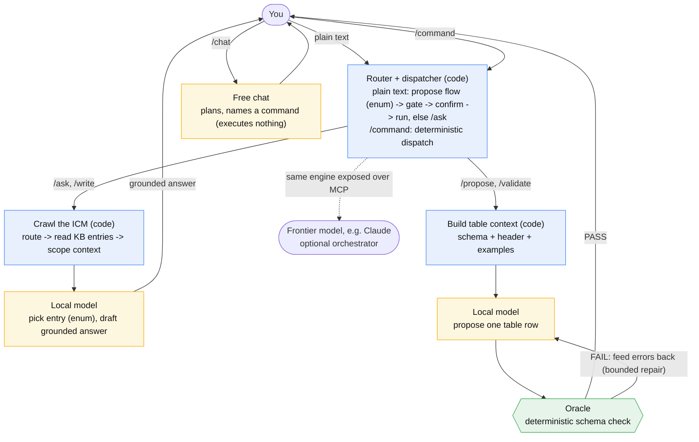

# A local-model host for Interpretable Context Methodology (ICM)

`icm` runs **ICM** instances on a small, local language model, adding a deterministic *oracle* that
checks the model's output. You point the host at a folder (an "instance") - a knowledge base, table
schemas, scripts, and workflows - and operate it from a **terminal operator console**: `icm <dir>`
opens the instance and drops you into a chat where you plan in natural language and act with slash
commands (built to run inside a VSCode integrated terminal, like `code <dir>`). The same engine is
also exposed over [MCP](https://modelcontextprotocol.io) and through a legacy desktop GUI.

It is Windows-native and dependency-light: it builds with the C# compiler that ships in the box with
the .NET Framework (no SDK, no NuGet, no MSBuild) and talks to a local [Ollama](https://ollama.com)
over plain HTTP.

## What is ICM?

**Interpretable Context Methodology (ICM)** is a methodology by Jake Van Clief and David McDermott
(University of Edinburgh / Eduba; MIT-licensed;
[paper](https://arxiv.org/abs/2603.16021),
[repo](https://github.com/RinDig/Interpretable-Context-Methodology-ICM)) that replaces
framework-level multi-agent orchestration with **filesystem structure**: folders are stages, plain
markdown files carry the prompts and context for a single orchestrating agent, and local scripts do
the mechanical work that needs no AI. Every stage's output is a plain file a human can read and edit
before the next stage runs, so the whole workflow stays inspectable and editable with a text editor.
The folder structure does what a framework would otherwise do in code: sequencing, context scoping,
and state.

This project applies those ideas to a **local** model and adds one piece the original does not need:
a deterministic **oracle**. A small local model is an unreliable decider, so here it never decides -
it *proposes*, and a deterministic check *accepts or rejects* each proposal.

## The idea: propose, then verify

A small local model is unreliable when you ask it to *decide* things or to drive an open-ended
tool-calling loop. It is reliable when each call is narrow and its output is checked. So this host
splits every task into three roles with one trust line:

| Role | Trusted to | Not trusted to |
| --- | --- | --- |
| **Model** (the proposer) | pick from an enum, draft text, write one table row | be right on its own; choose what runs next |
| **Code** (the glue) | read files, run tools, sequence steps | (it has no judgment to misuse) |
| **Oracle** (the decider) | accept or reject a proposal, deterministically | have opinions |

The oracle here is a **schema-driven validator for tab-separated tables**: it checks column count
(the classic "a tab got added or dropped" corruption), types, numeric ranges, and enum membership.
Because the verdict is deterministic, a wrong proposal is *caught*, not trusted - and the model can
be sent the exact errors and asked to try again, within a bound.

Two guardrails keep this honest:

- **The operator drives; the model never picks actions.** Slash commands dispatch deterministically;
  plain text runs the conversational **router** - the model proposes a flow from the closed, authored
  set, a deterministic gate keeps only a confident on-list match, and it runs after a `y/n` confirm or
  falls back to `/ask`. `/chat` is free conversation, `/do` an opt-in classifier. The model never
  improvises a tool loop.
- **Tools are declared; the model only fills arguments.** A tool's command is authored in the
  instance, never invented by the model. *Which* tool runs is decided by an authored workflow or by a
  capable orchestrator (e.g. Claude over MCP) - never by an open local-model loop.

## Local-model adaptation: how this differs from ICM

ICM as published assumes a *capable* orchestrating agent (the paper's examples use Claude) that
**roams the folder structure itself** - it reads the routing files, decides which entries and which
stage to load, produces each stage's output, and a human reviews the plain-file result. A small
**local** model simply *can't do that*: behind a generate API it has no file access and no tool use
at all - it only turns a prompt into text. (And even within a single call, it can't reliably be
trusted to decide what runs next or to format itself.) So this host keeps ICM's "structure is the
architecture" idea but moves the orchestration **out of the model and into deterministic code**, and
adds a machine check the frontier setup did not need.

| Concern | ICM (frontier agent) | This host (local model) |
| --- | --- | --- |
| Navigating the folders | the agent reads them and picks what to load | code crawls: the **embedder narrows** the candidates, a constrained **enum pick** chooses the entry, then code reads and **injects** the scoped context |
| Sequencing | the agent decides what runs next across numbered stages | explicit **slash commands** route to capabilities and authored **flows** sequence multi-step work; the model never picks the step (`/do` offers an opt-in classifier) |
| Checking output | a human reviews each stage's file | a deterministic **oracle** gates table output, with bounded repair (the human still edits) |
| Model output shape | trusted to format itself | **grammar/enum-constrained**, so only a valid shape can be emitted |
| Tools | the agent calls local scripts / MCP as it sees fit | tools are **declared**; the model only fills arguments; *which* tool runs is a flow's or a frontier orchestrator's call |
| Orchestrator seat | the capable agent, always | you direct it from the chat by default; the **same instance is exposed over MCP**, so a frontier model (or any other MCP client) can take the seat when you want |

The key move is the **injection**. Rather than letting the model wander the filesystem (safe for a
frontier model, not for a local one), the host does the layered context loading itself and injects
the precisely-scoped context into each constrained call. The model never crawls; code crawls *for*
it and hands it one narrow, checkable decision at a time. The same machinery is what the built-in MCP
server exposes - one engine, two callers: the local dispatcher, or a frontier model over MCP.



The blue nodes are deterministic code (the orchestrator), the amber nodes are the only points the
local model is called (each a single constrained proposal), and the green node is the oracle that
decides. Code does the crawling and the sequencing; the model only ever proposes.

## What you get

Two Windows executables built from one shared codebase:

- **`icm.exe`** - the terminal operator console and CLI. `icm <dir>` opens the console on an instance
  (VSCode-style), plus open / chat / mcp / flow / list / validate / gen / selftest. **This is the
  primary interface.**
- **`icm-gui.exe`** - a LEGACY "VSCode-lite" desktop GUI over the same engine: a workspace file
  tree (add / rename / delete / edit, confined to the opened folder), a text editor with a
  line-number gutter and find/replace, and a chat panel. Kept for existing users only; the console is
  the supported interface and does everything it does. Not built by default - use `build.ps1 -Gui`.

Prebuilt binaries are included in this folder, so you can run it without building anything.

## Getting Started

**1. Prerequisites.** Windows 10/11 (the .NET Framework 4.x it needs is already installed). For the
model-backed features, install [Ollama](https://ollama.com) and pull the two models:

```
ollama pull qwen3-coder
ollama pull nomic-embed-text
```

The host talks to `http://localhost:11434` by default and uses `qwen3-coder:latest` (generation) and
`nomic-embed-text` (search + routing). Change these per instance in `icm.config.json`, or override the
URL with `OLLAMA_URL`. `selftest`, `validate`, and script tools need no model.

**2. Verify the core** (no model needed):

```
.\icm.cmd selftest
```

**3. Open the operator console** on the bundled `windows-icm` instance (needs Ollama):

```
.\icm.cmd windows-icm
```

**4. Use it.** Inside the console:
- Type a plain question - you get a grounded answer from the knowledge base.
- `/flows` lists what it can do; `/help` lists every command.
- `/write a method that reverses a string` - generates C#, compiles it, and repairs until it builds.
- Append `> out\Reverse.cs` to any command to save its output to a file.
- `/chat <message>` for free conversation; `/note <text>` to jot session memory.

See [How the chat works](#how-the-chat-works) for the full model. Prefer one-shot runs?
`.\icm.cmd flow windows-icm csharp "a string reverser"` runs a single flow; `.\icm.cmd open windows-icm`
just loads and summarizes the instance.

**5. (Optional) Drive it from a frontier agent.** Connect Claude (or any MCP client) to
`.\icm.cmd mcp windows-icm` - see
[Drive it from a frontier model over MCP](#drive-it-from-a-frontier-model-over-mcp).

> **Why `.cmd` and not `.exe`?** Run the `.cmd` launchers, not the bare `.exe`. On Windows 11 with
> Smart App Control on, an unsigned `.exe` is blocked from running directly; the launchers load the
> program in-memory inside the already-trusted PowerShell, which SAC allows. Tip: add this folder to
> your `PATH` to run `icm ...` from anywhere (e.g. in the VS Code terminal). See
> [Running under Smart App Control](#running-under-smart-app-control).

## The GUI (legacy)

The terminal console is the primary, supported interface. The GUI is kept for legacy use only: it is
not built by default (use `build.ps1 -Gui`) and no new work targets it.

```
.\icm-gui.cmd                  # opens empty; use File > Open Folder
.\icm-gui.cmd windows-icm      # open straight into an instance
```

Open any folder as a workspace; the tree, editor, and file operations are confined to that root. When
the folder is an instance (it has an `icm.config.json`), the chat panel activates and the dispatcher's
step trace streams into the log.

### Keyboard shortcuts

| Key | Action | Key | Action |
| --- | --- | --- | --- |
| Ctrl+O | Open folder | Ctrl+G | Go to line |
| Ctrl+P | Quick Open (fuzzy file find) | Alt+Z | Toggle word wrap |
| Ctrl+N | New file | Ctrl++ / Ctrl+- / Ctrl+0 | Editor zoom in / out / reset |
| Ctrl+S | Save | F5 | Refresh tree |
| Ctrl+W | Close file | F8 | Validate current file (oracle on the editor buffer) |
| Ctrl+F / Ctrl+H | Find / Replace | Ctrl+Shift+E / Ctrl+L | Focus tree / chat |
| Ctrl+Z / Ctrl+Y | Undo / redo (editor) | Esc | Close Find / Quick Open |

File tree: `Del` delete, `F2` rename, `Enter` open. Chat input: `Enter` or `Ctrl+Enter` sends,
`Shift+Enter` inserts a newline.

## How the chat works

The console never lets the weak local model decide what runs:

- **Default = the conversational router.** Any line *without* a leading `/` is matched against the
  authored flows: the model proposes one (grammar-constrained to the real catalog), a deterministic
  gate keeps only an on-list, confident pick, and it runs after a `y/n` confirm (mode `router.autorun`:
  `confirm` / `on` / `off`). If nothing fits - or you asked a plain question - it falls back to a
  grounded `/ask`. Unrecognized commands fall back to `/ask` too.
- **Slash commands** - a line starting with `/` is dispatched **deterministically** by code (no
  classify step). The **generic** verbs are the harness (they name no specific capability):
  - `/ask <q>` - answer grounded in the matching knowledge-base entry (also the plain-text default).
  - `/make <prompt>` - freeform generation (no grounding, no oracle).
  - `/chat <message>` - free conversation: the model plans and names the command to run, executes nothing.
  - `/flow <name> <input>` - run any authored flow; `/tool <name> [arg]` - run any declared tool.
  - `/list [group]` / `/flows` / `/search [corpus] <q>` - enumerate the KB / flows / hybrid-search.
  - `/validate <table>` / `/propose <desc>` - the oracle path (validate a table; propose a gated row).
  - `/note <text>` / `/notes` - session memory; `/do <request>` - opt-in classify-and-route.

  **Instance-declared shortcuts** come from `commands` in `icm.config.json` - the host hardcodes none
  of them. `windows-icm` ships `/write`, `/csharp`, `/ps`, `/winforms`, `/snippet` (each -> a flow),
  `/compile` (-> the `build_csharp` tool), and `/run` (-> launch a built `.exe`). `/help` lists them.

Append `> path` to any command to save its output to a file in the workspace (markdown fences are
stripped, so a `.cs`/`.ps1` lands clean and the GUI opens it). Writes and `/note` lines are recorded
in `NOTES.md`, which the chat reads back so a new session is not cold.

### Model seats, and yes - it still generates plain text

A turn uses up to two model "seats", set per instance in `icm.config.json`:

- the **dispatch** seat - a small model used only by `/do` (and `/propose`'s table pick) for the
  constrained classify/route call;
- the **generate** seat - the model that writes text: casual chat, the grounded `/ask` answer, the
  `/write` code, the freeform `/make` output, and proposed rows.

They can be the same model (the example uses one for both) or two different models - a tiny model for
dispatch and a larger one for generation. And yes, the local model still does ordinary generative
text: casual chat, `/make`, and `icm gen` call the **generate** seat directly with **no oracle and no
schema constraint**. The oracle and the grammar constraints apply only to the structured paths
(`/write`, `/propose`, `/validate`); they never sit between you and free-form chat.

## Commands

```
icm <dir>                       open the operator console on an instance (VSCode-style; rel or abs path)
icm open  <dir>                 load + summarize an instance
icm chat  <dir>                 operator console (same as `icm <dir>`)
icm mcp   <dir>                 serve the instance over MCP (stdio)
icm flow  <dir> <name> [in...]  run an authored workflow (flows/<name>.json)
icm list  <dir> [--group G] [--type T] [--json]   enumerate the KB catalog
icm flows <dir>                 list the instance's workflows (the router's menu)
icm docsearch <dir> <corpus> <query...>           hybrid search a built refdocs corpus
icm reindex <dir>               regenerate manifest.json from files' <!--icm--> metadata blocks
icm validate <dir> <table>      run the oracle on schemas/<table>.json + samples/<table>.txt
icm validate-flow <dir> [name]  lint a flow (or all flows): node kinds, fields, tool refs
icm gen   <dir> <prompt...>     one raw generate call (smoke-test the model)
icm selftest                    check the deterministic core (no model)
```

`OLLAMA_URL` overrides the instance's configured `ollama_url`.

## Configuration

Configuration is **per-instance**: each instance folder has its own `icm.config.json`. There is no
global host config - point the host at a different folder and it uses that folder's settings. The
settings that matter most:

**Which model(s) to use.** The host uses named model "seats":

```json
"models": {
  "generate": "qwen3-coder:latest",
  "dispatch": "qwen3-coder:latest",
  "embed":    "nomic-embed-text"
}
```

- `generate` - writes the actual text (grounded answers, freeform `make`, proposed rows).
- `dispatch` - the small classify/route call (and the conversational router's flow pick); omit it to
  reuse the `generate` model.
- `embed` - powers hybrid search **and** narrows routing candidates (the embedder ranks flows / KB
  entries by similarity and keeps the top-k before the model picks). Optional: if unset or Ollama is
  down, routing falls back to offering the model the full list.

**Conversational router.** Plain text in the console is matched to an authored flow (the model
proposes from the closed catalog; a deterministic gate keeps only a confident, on-list pick). Control
it per instance:

```json
"router": { "autorun": "confirm" }
```

- `confirm` (default) - propose the inferred flow and ask `y/n` before running it.
- `on` - auto-run a high-confidence match; still ask for medium.
- `off` - disable routing; plain text goes straight to `/ask`.

Anything that doesn't match a flow falls back to a grounded `/ask`.

**Custom commands.** The binary is a domain-agnostic harness - it ships only generic verbs (`/flow`,
`/tool`, `/ask`, ...). An instance declares its own slash shortcuts under `commands`, each mapping a
name to a flow, a tool, or a detached launch:

```json
"commands": [
  { "name": "write",   "flow": "write_grounded", "help": "generate C#, compile, repair" },
  { "name": "compile", "tool": "build_csharp", "arg": "src", "help": "build a .cs to a runnable .exe" },
  { "name": "run",     "launch": "run_app", "help": "launch a built .exe (detached)" }
]
```

The host dispatches all three kinds generically and lists them in `/help`. A different domain (a
compliance ICM, a Python ICM) declares entirely different commands - the binary never changes. This
is the host/instance boundary: the framework is in the exe; the implementation is in the instance.

**Search corpora.** `/search` and the `search` flow node read corpora from `refdocs-seed/`. The
shipped `dotnet` (API signatures) and `dotnet_prose` (conceptual docs) corpora are committed there, so
search works on a fresh clone. Embedding vectors are generated lazily on the first search and cached
in `refdocs/` (gitignored, rebuilt on demand, and skipped gracefully when no embed model is present).
Rebuild a corpus with the `build_*_docs` tools - they write to `refdocs/`, which overrides the seed.

Use any models you have pulled in Ollama (`ollama pull <name>`, list with `ollama list`). The flat
fields `model` / `embed_model` are also accepted as a fallback.

**The Ollama connection.** Defaults to `http://localhost:11434`. Set it per instance:

```json
"ollama_url": "http://localhost:11434"
```

or override it for a single run with the `OLLAMA_URL` environment variable (the env var wins over the
file). Point this at a different port or a remote Ollama as needed.

**Other settings.** `name` and `domain` (shown by `icm open` and woven into prompts) and `tools` (the
capabilities the instance exposes - see [Tools](#tools)).

After editing, run `icm open <dir>` to see the resolved model seats and Ollama URL it will use.

## Build your own instance (the contract)

An instance is just a folder. Copy `windows-icm/` and edit the pieces you need - the host runs
whatever it finds, and every piece is optional.

```
my-icm/
  icm.config.json     name, domain, model seats, and the tools this instance exposes
  manifest.json       the routing index: {id, title, path, summary} per knowledge-base entry
  SYSTEM.md           operating rules injected into grounded answers
  kb/*.md             knowledge-base entries (one topic per file) - the grounding for `ask`
  schemas/<t>.json    a table schema: columns with type / required / min / max / enum values
  samples/<t>.txt     tab-separated data for table <t> (first line is the header)
  tools/*             scripts the host can run (declared in icm.config.json)
  flows/*.json        authored workflows
```

`icm.config.json` looks like:

```json
{
  "name": "my-icm",
  "domain": "what this instance is about",
  "models": { "generate": "qwen3-coder:latest", "dispatch": "qwen3-coder:latest", "embed": "nomic-embed-text" },
  "ollama_url": "http://localhost:11434",
  "tools": [
    { "name": "ask",      "kind": "kb_answer", "description": "Answer from the knowledge base." },
    { "name": "validate", "kind": "validate",  "description": "Validate a table against its schema." },
    { "name": "propose",  "kind": "propose",   "description": "Propose a validated new row." }
  ]
}
```

A directory with no `icm.config.json` still opens (sensible defaults plus its knowledge base), so you
can start with just a `manifest.json` and a `kb/` folder and grow from there.

## Tools

A tool lets the host run a script or command an instance provides. Declare it in `icm.config.json`
with a `command` (an argv array) or a `script` (a `.ps1` file under `tools/`):

```json
{
  "name": "csc_check", "kind": "command",
  "description": "Compile a C# file with the in-box csc and report OK or the diagnostics.",
  "command": ["powershell","-NoProfile","-ExecutionPolicy","Bypass","-File","tools/csc_check.ps1"],
  "inputSchema": { "type": "object", "properties": { "code": { "type": "string" } }, "required": ["code"] },
  "stdin": "code",
  "timeout": 60
}
```

The host runs the command with the **instance folder as the working directory** (so relative
`tools/...` paths resolve), substitutes `{arg}` placeholders into the argv from the call's arguments,
optionally pipes one argument to standard input instead (`"stdin": "argname"` - use this for large
payloads like source code), enforces `timeout` (seconds), and captures stdout / stderr / exit code.
The command is an argv array (not a shell string), so there is no shell-injection surface. The
instance author writes the command; the caller only fills the declared arguments. (Note: a stdin
payload arrives with a leading UTF-8 BOM, so a stdin-reading tool should strip it - see
`windows-icm/tools/csc_check.ps1`.)

## Flows (authored workflows)

A flow (`flows/<name>.json`) is an ordered list of nodes over a shared state "blackboard"; each node
declares the `inputs` it reads and the `outputs` it writes. The flow is the orchestrator - the model
proposes inside nodes but never decides what runs next. Node kinds:

- `route` request -> entry_id (constrained pick of a knowledge-base entry)
- `read` entry_id -> context (code reads the entry; no model)
- `generate` templated prompt -> text (`prompt` supports `{state}` substitution)
- `answer` request + context -> answer (grounded with `SYSTEM.md`)
- `propose` table + request -> row, ok (proposer -> oracle -> bounded repair)
- `validate` table [+ tsv] -> verdict, ok (the oracle)
- `tool` named tool + args -> output, ok (runs a command/script tool)
- `loop` repeat a `body` of nodes until a state key is truthy (`until`), or `maxIterations` times -
  the bounded repair/retry primitive that makes a flow an assembly line

```json
{ "name": "answer", "description": "Grounded knowledge-base answer",
  "nodes": [
    { "id": "route",  "kind": "route",  "inputs": ["request"],            "outputs": ["entry_id"] },
    { "id": "read",   "kind": "read",   "inputs": ["entry_id"],           "outputs": ["context"] },
    { "id": "answer", "kind": "answer", "inputs": ["request", "context"], "outputs": ["answer"] }
  ] }
```

A `loop` node holds a `body` of nodes and repeats it until a state key is truthy (`until`) or up to
`maxIterations`. This is how a "generate, check, repair until it passes" capability is built - as an
*authored flow*, not a hardcoded host feature. The check is just a declared `tool` (a compiler, a
parser, a linter), and its `output` is fed back into the next prompt:

```json
{ "name": "code-from-spec", "description": "Generate code, compile it, repair until it builds",
  "nodes": [
    { "id": "build", "kind": "loop", "maxIterations": 4, "until": "ok", "outputs": ["code"],
      "body": [
        { "id": "gen",   "kind": "generate", "outputs": ["code"],
          "prompt": "Write C# for: {request}\nIf the compiler reported errors last time, fix them:\n{output}" },
        { "id": "check", "kind": "tool", "tool": "csc_check", "args": { "code": "{code}" }, "outputs": ["output"] }
      ] }
  ] }
```

The `tool` node sets `ok` (did the command succeed) and `output` (its diagnostics); the loop stops
when `ok` is true or after `maxIterations`. Swap `csc_check` for any check command an instance
declares, and you have a verify-and-repair line for that language.

Run a flow with `icm flow <dir> <name> [input...]`, or expose it as a tool (`{"kind": "flow",
"flow": "answer"}`) so an MCP client can call it. The bundled `windows-icm/flows/` has `answer`
(grounded Q&A) plus `csharp` and `powershell` (generate -> verify -> repair, using `csc_check` /
`ps_parse` as the oracle).

## Drive it from a frontier model over MCP

`icm mcp <dir>` serves the instance over stdio JSON-RPC. `tools/list` advertises:

- the built-ins **`catalog`** (browse the KB: id, group, summary; optional `group`/`doc_type` filters)
  and **`read_entry`** (read one entry's full text, routing metadata stripped),
- the instance's **command/script tools** (with their input schemas), the **oracle** (`validate`), the
  **propose** loop, and whole **flows** (`flow`-kind tools).

`tools/call` runs them. This is the same engine the local console uses, exposed so a capable
orchestrator (Claude, etc.) can browse → read → run while the local model keeps filling the narrow,
oracle-checked slots. The frontier model does the loose inference ("what's the workflow for X?") and
calls the matching flow/tool; the host executes it deterministically. (Orchestrating *existing*
capabilities works today; having the frontier model author and register a brand-new flow is roadmap.)

**Connect a client.** Because Smart App Control blocks the bare `.exe` (see below), point the client
at the in-memory launcher `run-cli.ps1`, not `icm.exe`. Use absolute paths.

Claude Desktop (`claude_desktop_config.json`):

```json
{
  "mcpServers": {
    "windows-icm": {
      "command": "powershell",
      "args": ["-NoProfile", "-ExecutionPolicy", "Bypass", "-File",
               "C:\\path\\to\\win_icm_code\\run-cli.ps1", "mcp",
               "C:\\path\\to\\win_icm_code\\windows-icm"]
    }
  }
}
```

Claude Code:

```
claude mcp add windows-icm -- powershell -NoProfile -ExecutionPolicy Bypass -File C:\path\to\win_icm_code\run-cli.ps1 mcp C:\path\to\win_icm_code\windows-icm
```

**Verify the server** without a client first: `powershell -NoProfile -File mcp-smoke.ps1` drives the
full handshake (initialize / tools/list / catalog / read_entry / ping) over stdio and asserts the
responses - run it after a build to confirm the MCP surface is healthy.

## Security

Opening an instance can run its declared **command/script tools** (PowerShell, external programs) on
your machine - that is how the host does real work. **Only open instances you trust**, and skim their
`icm.config.json` + `tools/` first. The local model never picks or runs tools on its own (it only
proposes into oracle-checked slots), file I/O is sandboxed to the instance root, and the host's only
network egress is to your local Ollama. The same trust rule applies when a frontier model drives the
host over MCP. Full details: [SECURITY.md](SECURITY.md).

## Running under Smart App Control

Windows 11's Smart App Control blocks running unsigned, locally-built or freshly-downloaded `.exe`
files directly. It does **not** block in-memory managed execution inside the already-trusted,
Microsoft-signed PowerShell. The launchers in this folder use that: they read the program's bytes and
run them in-process.

- Use `icm.cmd` / `icm-gui.cmd` (or `run-cli.ps1` / `run-gui.ps1`). Running `icm.exe` / `icm-gui.exe`
  directly may be blocked.
- This is the user's own local program running on the user's own machine; Smart App Control still
  guards everything else.

## Build from source

```
powershell -ExecutionPolicy Bypass -File build.ps1          # console only (default)
powershell -ExecutionPolicy Bypass -File build.ps1 -Gui     # also rebuild the legacy GUI
```

This is a **console-first** app: the default build writes only `icm.exe`. The legacy WinForms
`icm-gui.exe` is built only with `-Gui`. The script calls the in-box .NET Framework C# compiler
(`csc.exe`, pre-Roslyn, so the code targets C# 5) with no SDK, NuGet, or MSBuild. It globs `src\`
recursively and partitions by folder so each executable has exactly one entry point: the `Cli\` folder
(console) is excluded from the GUI build and the `Gui\` folder (WinForms) from the console build.
Non-default references: `System.Web.Extensions.dll` (JSON) for both, and `System.Windows.Forms.dll` +
`System.Drawing.dll` for the GUI. Verify a build with `.\icm.cmd selftest`.

## Project layout (`src/`)

One flat `namespace Icm`; folders are organizational.

```
Conventions.cs   the instance contract in one place: file/dir names + intent/tool/node kind constants
Json.cs          JSON parse/serialize + navigation + small object/schema builders
Model/           pure data: Config, Manifest, TableSchema, Flow, Results
Runtime/         the engine: Instance (sandboxed IO), Oracle, Tsv, ToolRunner, Ollama, Dispatcher, FlowEngine
Server/Mcp.cs    the MCP server (tools/list + tools/call)
Cli/             the console executable: Program, ConsoleChat, SelfTest
Gui/             the GUI executable (WinForms): Gui, Native
```

## Status

**Beta** - working and self-consistent; usable by a technical user who follows this README.

Working: instance loading; the operator console (conversational router, slash commands, casual
`/chat`, `NOTES.md` session memory, output redirect to files); the oracle (`validate` / `propose` with
bounded repair) and the compiler/parser oracles for code; grounded `ask` and authored flows (including
generate-compile-repair); hybrid BM25+embedding search with shipped corpora; **embedder-narrowed
routing** (the `embed` seat ranks flows / KB entries before the model picks); KB enumeration
(`catalog` / `list` / `flows`); **console token streaming** for freeform generation (`/ask`, `/make`,
`/chat`, and flow `generate`/`answer` nodes print token-by-token; the legacy GUI does not); the legacy
WinForms GUI (with markdown rendering); and the MCP server (verified by `mcp-smoke.ps1`).

Not yet implemented: a frontier model authoring + registering *new* flows over MCP (it can run
existing ones); cross-table reference checks in the oracle; and a built PowerShell docs corpus.

## License

MIT - see [LICENSE](LICENSE). The Interpretable Context Methodology it builds on is also
MIT-licensed by Jake Van Clief and David McDermott.
